

<h1 align="center">C# Live Project Code Summary</h1>

  
This project was a web application for a theatre in Portland, OR. 

 

<!-- TABLE OF CONTENTS -->

  
Table of Contents

  <ol>
    <li>
      <a href="#about-the-project">About The Project</a>
      <ul>
        <li><a href="#built-with">Built With</a></li>
      </ul>
    </li>
    <li>
      <a href="#code-summary">Code Summary</a>
      <ul>
        <li><a href="#story-one">Story One</a></li>
        <li><a href="story-two">Story Two</a></li>
        <li><a href="story-three">Story Three</a></li>
      </ul>
    </li>
  </ol>

 

<!-- ABOUT THE PROJECT -->

## About The Project

Each team was assigned a section of the site to work on which consisted of the rentals, production, and a blog. I was part of the production team. We held a sprint planning meeting on the first day, daily scrum meetings, and a code retrospective at the end of the sprint. In order to pass this project I was required to have 3 stories completed and approved by the scrum master.

(<a href="#readme-top">back to top</a>)

 

## Built With

- Visual Studio ASP.NET MVC
- C#
- Entity Framework Database
- Bootstrap 4
- SQL Server
- Agile/Scrum Methodology
- Azure DevOps
- Git Version Control

(<a href="#readme-top">back to top</a>)

 

<!-- CODE SUMMARY -->

## Code Summary

<ul>
        <li><a href="#story-one">Story One</a></li>
        <li><a href="story-two">Story Two</a></li>
        <li><a href="story-three">Story Three</a></li>
</ul>

 

## Story One

For the first story I was asked to create a form that takes the User's first and last name, Email address, subject, and message for the contact page. To the right of the form they wanted to have an option for users to donate and volunteer. I was given this mockup to recreate:

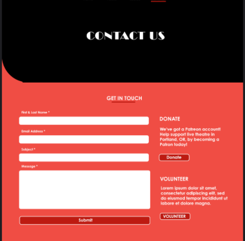

 Here is my finished product: 

(<a href="#readme-top">back to top</a>)

 

## Story Two
There were two parts to this story. First, I created a model for the productions section of the site using the following schema:

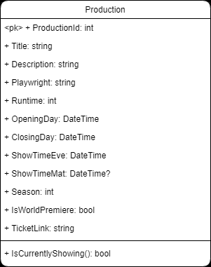

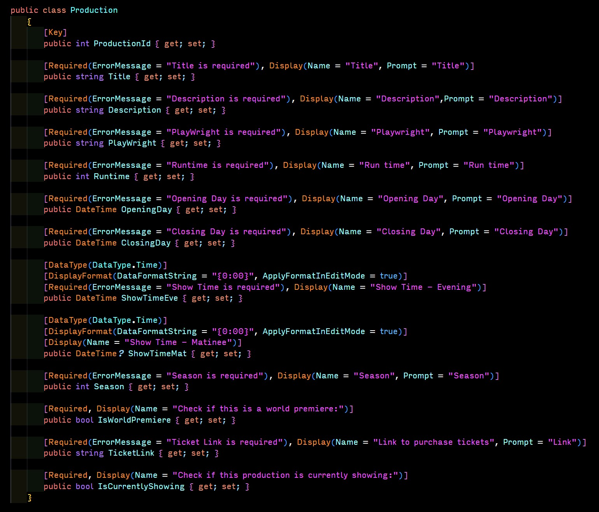

 For the second part, I used the entity framework to create the CRUD (Index, Edit, Create, Details, and Delete) pages. Here are a few snippets:
<table>
  <tr>
    <td> 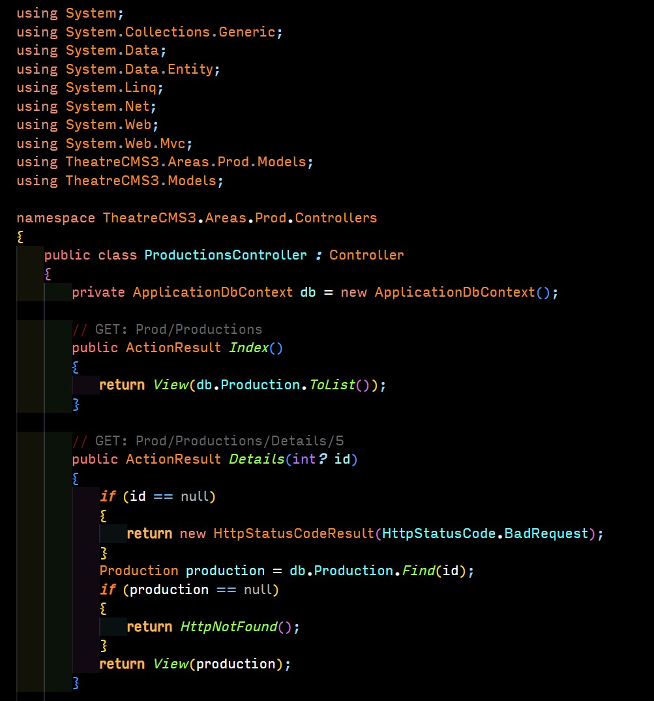</td>
    <td> 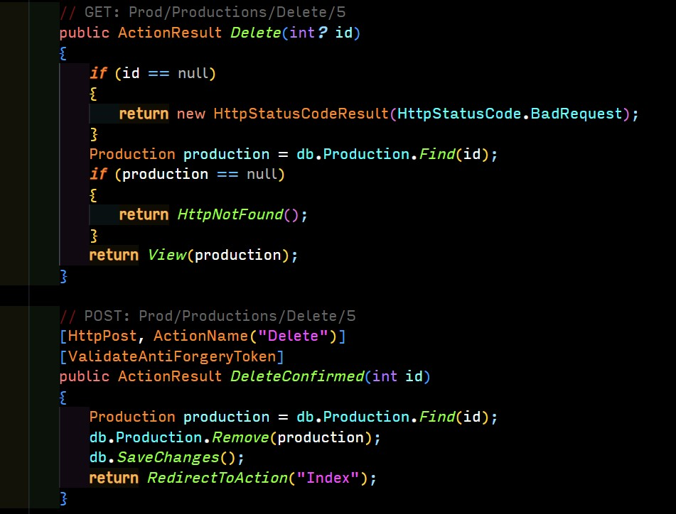</td>
   </tr> 
  </tr>
</table>

(<a href="#readme-top">back to top</a>)

 

## Story Three
For the final story I was tasked with styling the Create and Edit pages: 
 
<ul>
    <li> 
Add a header above the form with the following text "Create Production" on a single line. 

        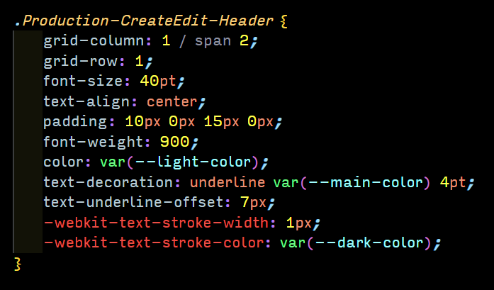
    <li> 
Style the Submit and Back to List buttons (background color, rounded corners, subtle hover effect, etc.).  
          There should be a color distinction between these two buttons and they should both be centered on the page.

        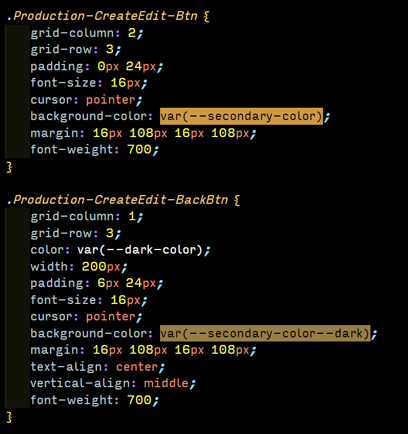 
        
Hover effect: 
 
        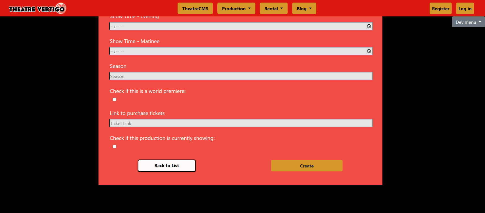 
    <li> 
Add placeholders to all input fields. 

        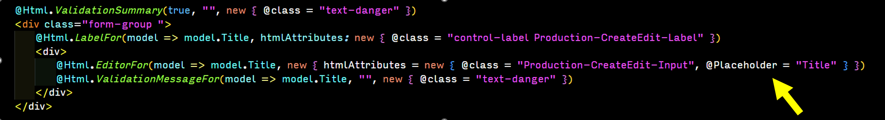
    <li> 
Place the form in a centered container. 

         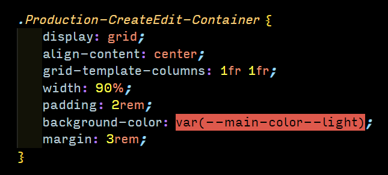
    <li> 
Currently, the input fields' border color changes when clicked. We want this color changed to match the theme of our website.  
          We would also like the color of the input field to change when clicked as well.  

         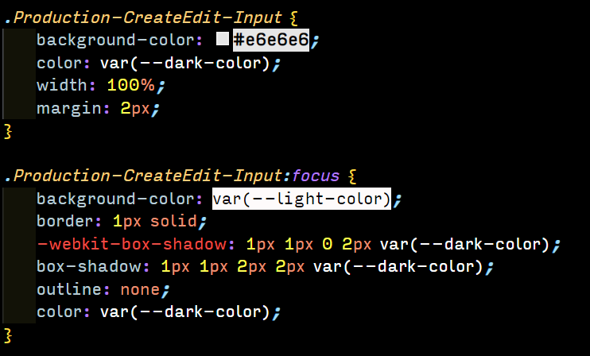
</ul>

 

### Finished Create and Edit Pages

<table>
    <tr>
        <td> 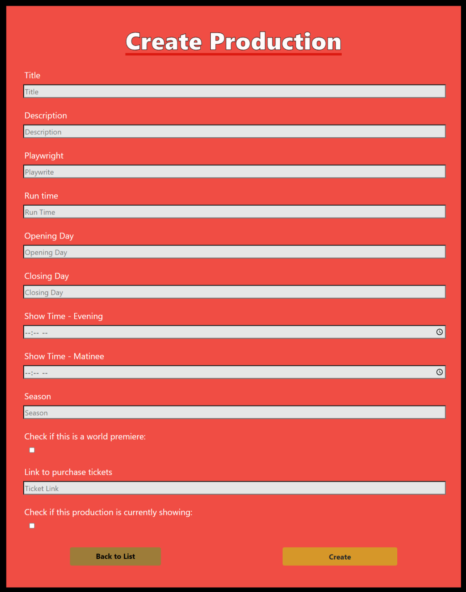</td>
        <td>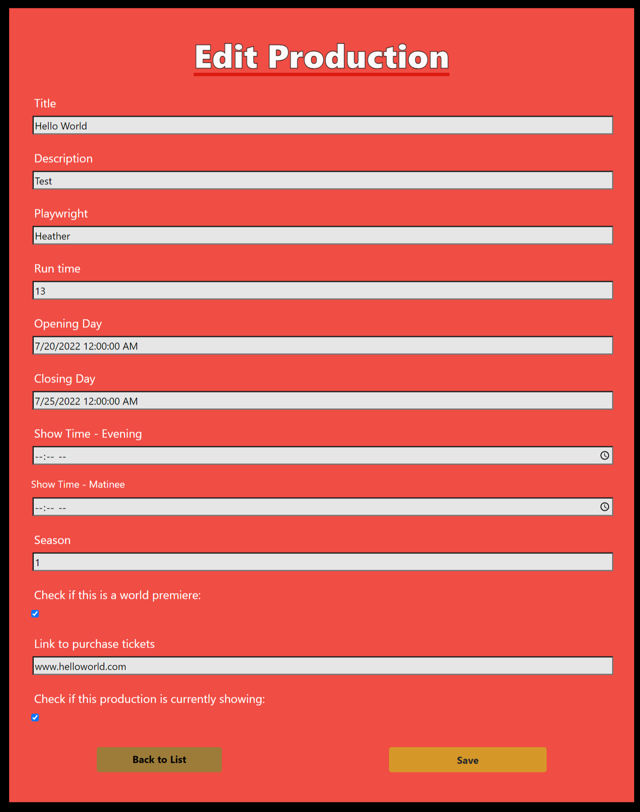</td>
    </tr> 
</table>

(<a href="#readme-top">back to top</a>)

 

---

 Created by Heather Shultz - feel free to contact me!

