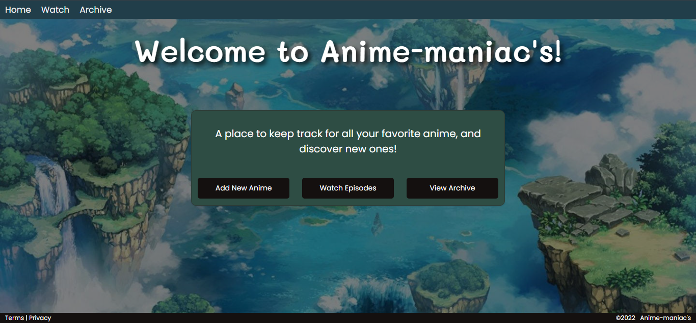

<h1 align="center">Django Live Project Code Summary</h1>

This project is a interactive website for managing one's collections of things related to various hobbies.

 

  
Table of Contents

  <ul>
    <li>
      <a href="#project-overview">Project Overview</a>
      <ul>
        <li><a href="#built-with">Built With</a></li>
      </ul>
    </li>
    <li>
      <a href="#project-details">Project Details</a>
      <ul>
        <li><a href="#story-one">Story One</a></li>
	<li><a href="#story-two">Story Two</a></li>
	<li><a href="#story-three">Story Three</a></li>
        <li><a href="#story-four">Story Four</a></li>
        <li><a href="#story-five">Story Five</a></li>
      </ul>
    </li>
  </ol>

 

## Project Overview

>During a two week sprint I worked along side my peers to create a place to track our respective hobbies. It started with a "sprint planning" meeting, in which we were >introduced to the project, general guidelines and best practices. We attended a daily "scrum meeting" where each of us shared what we worked on last, what tasks they >expect to complete by the next scrum, and any roadblocks we faced. In order to  successfully pass this project, I was expected to complete a total of four stories >according to the scrum master's specifications. The last day of the sprint our team held a "code retrospective" in which we shared what was learned during the sprint, >what still need to improved, and how what was learned that could be applied in the future.

 

## Built With

> - Python
> - Django  
> - SQLite
> - HTML/CSS
> - Agile/Scrum Methodology
> - Azure DevOps
> - Git Version Control

 

## Project Details

- [Story One](#story-one)
- [Story Two](#story-two)
- [Story Three](#story-three)
- [Story Four](#story-four)
- [Story Five](#story-five)

 

## Story One
Create a new app for the project starting with the homepage that includes: -Navbar -Background -Title -Footer(Optional)

(<a href="#readme-top">back to top</a>)

 

## Story Two
Create a model for a database that will hold the collection of things, user should be able to add to the database through the template. 

<a href="#readme-top">back to top</a>

 

## Story Three
Add a functioning page that lists the items in the database.

(<a href="#readme-top">back to top</a>)

 

## Story Four
Create a page that will show the details of any single item from within the database, as selected by the user

(<a href="#readme-top">back to top</a>)

 

## Story Five
Include edit and delete functions for the user to modify the selected entry

(<a href="#readme-top">back to top</a>)

 

* * *

 Created by Heather Shultz - feel free to contact me!

(<a href="#readme-top">back to top</a>)

